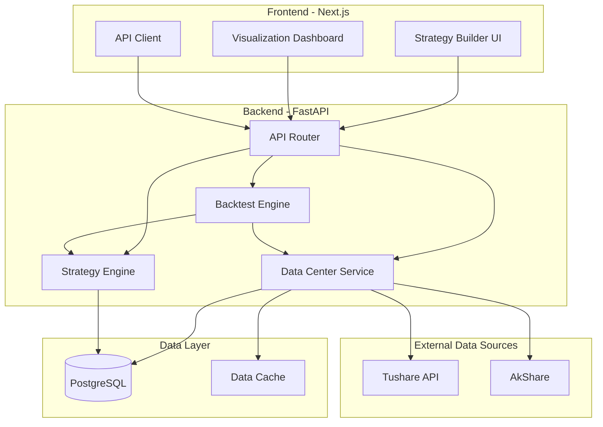

# Quant Investment Platform MVP - Technical Design

Feature Name: quant-investment-platform
Updated: 2026-02-15

## Description

这是一个面向个人投资者的无代码量化投资平台 MVP。用户通过 Web UI 界面进行策略构建（筛选条件、排名规则、交易规则），平台在历史数据上执行回测，并可视化展示回测结果。系统采用前后端分离架构，后端使用 Python/FastAPI 处理金融数据和回测逻辑，前端使用 Next.js + ECharts 实现交互式可视化。

## Architecture

### System Architecture Overview



### Technology Stack

| Layer | Technology | Purpose |
|-------|------------|---------|
| Frontend Framework | Next.js 14+ | React SSR/SSG 框架 |
| Frontend Language | TypeScript | 类型安全 |
| Frontend Styling | Tailwind CSS | 样式系统 |
| Charting Library | ECharts | K线图、收益曲线等 |
| Backend Framework | FastAPI | Python 异步 Web 框架 |
| Data Processing | Pandas, NumPy | 金融数据处理 |
| Database | PostgreSQL + TimescaleDB | 时序数据存储 |
| ORM | SQLAlchemy | 数据库操作 |
| Data Source | Tushare / AkShare | A股行情数据 |

## Components and Interfaces

### 1. Data Center (数据中心)

负责数据的获取、存储和查询。

#### 1.1 DataFetcher Interface

```python
# backend/services/data_fetcher.py

from abc import ABC, abstractmethod
from typing import List, Optional
from datetime import date
import pandas as pd

class DataFetcher(ABC):
    """数据获取抽象接口"""

    @abstractmethod
    async def fetch_daily_quotes(
        self,
        ts_code: str,
        start_date: date,
        end_date: date
    ) -> pd.DataFrame:
        """获取日线行情数据 (OHLCV)"""
        pass

    @abstractmethod
    async def fetch_financial_indicators(
        self,
        ts_code: str,
        period: Optional[str] = None
    ) -> pd.DataFrame:
        """获取财务指标数据"""
        pass

    @abstractmethod
    async def fetch_stock_list(self) -> pd.DataFrame:
        """获取股票列表"""
        pass

class TushareFetcher(DataFetcher):
    """Tushare 数据源实现"""
    pass

class AkShareFetcher(DataFetcher):
    """AkShare 数据源实现"""
    pass
```

#### 1.2 DataCache Interface

```python
# backend/services/data_cache.py

from typing import Optional
from datetime import date
import pandas as pd

class DataCache:
    """数据缓存服务"""

    async def get_cached_quotes(
        self,
        ts_code: str,
        start_date: date,
        end_date: date
    ) -> Optional[pd.DataFrame]:
        """从缓存获取行情数据"""
        pass

    async def cache_quotes(
        self,
        ts_code: str,
        data: pd.DataFrame
    ) -> None:
        """缓存行情数据"""
        pass

    async def invalidate_cache(self, ts_code: str) -> None:
        """使缓存失效"""
        pass
```

#### 1.3 Data Center Service

```python
# backend/services/data_center.py

from typing import List, Optional
from datetime import date
import pandas as pd

class DataCenterService:
    """数据中心服务 - 统一数据访问入口"""

    def __init__(self, fetcher: DataFetcher, cache: DataCache):
        self.fetcher = fetcher
        self.cache = cache

    async def get_daily_quotes(
        self,
        ts_code: str,
        start_date: date,
        end_date: date,
        use_cache: bool = True
    ) -> pd.DataFrame:
        """获取日线行情 - 优先缓存"""
        pass

    async def get_financial_data(
        self,
        ts_code: str
    ) -> pd.DataFrame:
        """获取财务数据"""
        pass

    async def get_factor_data(
        self,
        factor_names: List[str],
        date: date,
        universe: Optional[List[str]] = None
    ) -> pd.DataFrame:
        """获取因子数据 - 用于筛选"""
        pass

    async def refresh_data(
        self,
        ts_codes: Optional[List[str]] = None
    ) -> dict:
        """刷新数据"""
        pass
```

### 2. Strategy Engine (策略引擎)

负责策略定义、验证和执行准备。

#### 2.1 Strategy Model

```python
# backend/models/strategy.py

from pydantic import BaseModel, Field
from typing import List, Optional, Literal
from enum import Enum

class Operator(str, Enum):
    """比较运算符"""
    GT = ">"
    GTE = ">="
    LT = "<"
    LTE = "<="
    EQ = "=="
    NEQ = "!="
    BETWEEN = "between"

class LogicOperator(str, Enum):
    """逻辑运算符"""
    AND = "and"
    OR = "or"

class FilterCondition(BaseModel):
    """筛选条件"""
    factor_name: str = Field(..., description="因子名称")
    operator: Operator = Field(..., description="比较运算符")
    value: float | tuple[float, float] = Field(..., description="比较值")
    logic_op: Optional[LogicOperator] = Field(None, description="与下一条件的逻辑关系")

class RankingRule(BaseModel):
    """排名规则"""
    factor_name: str = Field(..., description="排名因子")
    ascending: bool = Field(False, description="是否升序")
    weight: float = Field(1.0, description="权重")

class RebalanceFrequency(str, Enum):
    """调仓频率"""
    DAILY = "daily"
    WEEKLY = "weekly"
    MONTHLY = "monthly"
    CUSTOM = "custom"

class TradingRule(BaseModel):
    """交易规则"""
    rebalance_frequency: RebalanceFrequency = Field(RebalanceFrequency.WEEKLY)
    max_position_pct: float = Field(0.1, description="单只股票最大持仓比例")
    cash_reserve_pct: float = Field(0.05, description="现金保留比例")
    commission_rate: float = Field(0.0003, description="手续费率")
    slippage: float = Field(0.0, description="滑点")

class Strategy(BaseModel):
    """策略模型"""
    id: Optional[str] = None
    name: str = Field(..., description="策略名称")
    description: Optional[str] = None
    universe: List[str] = Field(default=["all"], description="股票池")
    filter_conditions: List[FilterCondition] = Field(default_factory=list)
    ranking_rules: List[RankingRule] = Field(default_factory=list)
    trading_rule: TradingRule = Field(default_factory=TradingRule)
    top_n: int = Field(10, description="持仓股票数量")
    created_at: Optional[str] = None
    updated_at: Optional[str] = None
```

#### 2.2 Strategy Service

```python
# backend/services/strategy_service.py

from typing import List, Optional
from models.strategy import Strategy
import pandas as pd

class StrategyService:
    """策略服务"""

    async def create_strategy(self, strategy: Strategy) -> Strategy:
        """创建策略"""
        pass

    async def get_strategy(self, strategy_id: str) -> Optional[Strategy]:
        """获取策略"""
        pass

    async def list_strategies(self) -> List[Strategy]:
        """列出所有策略"""
        pass

    async def update_strategy(self, strategy: Strategy) -> Strategy:
        """更新策略"""
        pass

    async def delete_strategy(self, strategy_id: str) -> bool:
        """删除策略"""
        pass

    async def preview_stocks(
        self,
        strategy: Strategy,
        date: pd.Timestamp
    ) -> pd.DataFrame:
        """预览策略选股结果"""
        pass

    async def validate_strategy(self, strategy: Strategy) -> List[str]:
        """验证策略配置"""
        pass
```

### 3. Backtest Engine (回测引擎)

负责策略回测执行和绩效计算。

#### 3.1 Backtest Engine

```python
# backend/services/backtest_engine.py

from typing import Optional
from datetime import date
from models.strategy import Strategy
import pandas as pd

class BacktestResult(BaseModel):
    """回测结果"""
    strategy_id: str
    start_date: date
    end_date: date
    total_return: float
    annual_return: float
    max_drawdown: float
    sharpe_ratio: float
    win_rate: float
    profit_loss_ratio: float
    excess_return: float
    net_value_series: pd.DataFrame
    positions_history: List[dict]
    trades: List[dict]

class BacktestEngine:
    """回测引擎"""

    def __init__(
        self,
        data_center: DataCenterService,
        strategy_service: StrategyService
    ):
        self.data_center = data_center
        self.strategy_service = strategy_service

    async def run_backtest(
        self,
        strategy: Strategy,
        start_date: date,
        end_date: date,
        initial_capital: float = 1000000.0,
        benchmark: Optional[str] = "000300.SH"
    ) -> BacktestResult:
        """
        执行回测

        核心流程:
        1. 加载历史数据
        2. 按调仓频率遍历交易日
        3. 在每个调仓日执行选股逻辑
        4. 计算交易成本并调整持仓
        5. 记录净值和交易明细
        6. 计算绩效指标
        """
        pass

    def _select_stocks(
        self,
        strategy: Strategy,
        date: pd.Timestamp,
        data: pd.DataFrame
    ) -> List[str]:
        """根据策略筛选和排名股票"""
        pass

    def _calculate_performance(
        self,
        net_values: pd.Series,
        trades: List[dict],
        benchmark_data: Optional[pd.DataFrame]
    ) -> dict:
        """计算绩效指标"""
        pass
```

#### 3.2 Performance Calculator

```python
# backend/services/performance_calculator.py

import numpy as np
import pandas as pd

class PerformanceCalculator:
    """绩效计算器"""

    @staticmethod
    def annual_return(returns: pd.Series, periods_per_year: int = 252) -> float:
        """年化收益率"""
        pass

    @staticmethod
    def max_drawdown(net_values: pd.Series) -> tuple[float, pd.Timestamp, pd.Timestamp]:
        """最大回撤及发生时间"""
        pass

    @staticmethod
    def sharpe_ratio(
        returns: pd.Series,
        risk_free_rate: float = 0.03,
        periods_per_year: int = 252
    ) -> float:
        """夏普比率"""
        pass

    @staticmethod
    def win_rate(trades: List[dict]) -> float:
        """胜率"""
        pass

    @staticmethod
    def profit_loss_ratio(trades: List[dict]) -> float:
        """盈亏比"""
        pass

    @staticmethod
    def excess_return(
        strategy_returns: pd.Series,
        benchmark_returns: pd.Series
    ) -> float:
        """超额收益"""
        pass
```

### 4. API Router (API 路由)

#### 4.1 RESTful API Endpoints

```python
# backend/api/routes.py

from fastapi import APIRouter, HTTPException
from typing import List, Optional
from datetime import date

router = APIRouter()

# ==================== 数据中心 API ====================

@router.get("/api/stocks")
async def list_stocks():
    """获取股票列表"""
    pass

@router.get("/api/stocks/{ts_code}/quotes")
async def get_stock_quotes(
    ts_code: str,
    start_date: date,
    end_date: date
):
    """获取股票行情数据"""
    pass

@router.get("/api/stocks/{ts_code}/financial")
async def get_stock_financial(ts_code: str):
    """获取股票财务数据"""
    pass

@router.post("/api/data/refresh")
async def refresh_data(ts_codes: Optional[List[str]] = None):
    """刷新数据"""
    pass

# ==================== 策略管理 API ====================

@router.post("/api/strategies")
async def create_strategy(strategy: StrategyCreate):
    """创建策略"""
    pass

@router.get("/api/strategies")
async def list_strategies():
    """获取策略列表"""
    pass

@router.get("/api/strategies/{strategy_id}")
async def get_strategy(strategy_id: str):
    """获取策略详情"""
    pass

@router.put("/api/strategies/{strategy_id}")
async def update_strategy(strategy_id: str, strategy: StrategyUpdate):
    """更新策略"""
    pass

@router.delete("/api/strategies/{strategy_id}")
async def delete_strategy(strategy_id: str):
    """删除策略"""
    pass

# ==================== 策略预览 API ====================

@router.post("/api/strategies/preview")
async def preview_strategy(
    strategy: StrategyConfig,
    date: date
):
    """预览策略选股结果"""
    pass

# ==================== 回测 API ====================

@router.post("/api/backtest/run")
async def run_backtest(request: BacktestRequest):
    """执行回测"""
    pass

@router.get("/api/backtest/results/{backtest_id}")
async def get_backtest_result(backtest_id: str):
    """获取回测结果"""
    pass
```

### 5. Frontend Components (前端组件)

#### 5.1 Strategy Builder Components

```typescript
// frontend/src/components/StrategyBuilder/types.ts

export type Operator = '>' | '>=' | '<' | '<=' | '==' | '!=' | 'between';
export type LogicOperator = 'and' | 'or';

export interface FilterCondition {
  factorName: string;
  operator: Operator;
  value: number | [number, number];
  logicOp?: LogicOperator;
}

export interface RankingRule {
  factorName: string;
  ascending: boolean;
  weight: number;
}

export interface TradingRule {
  rebalanceFrequency: 'daily' | 'weekly' | 'monthly' | 'custom';
  maxPositionPct: number;
  cashReservePct: number;
  commissionRate: number;
  slippage: number;
}

export interface Strategy {
  id?: string;
  name: string;
  description?: string;
  universe: string[];
  filterConditions: FilterCondition[];
  rankingRules: RankingRule[];
  tradingRule: TradingRule;
  topN: number;
}
```

#### 5.2 Visualization Components

```typescript
// frontend/src/components/Visualization/

// KlineChart.tsx - K线图组件
// Props: tsCode, startDate, endDate, signals (买卖点标注)

// EquityCurveChart.tsx - 净值曲线图
// Props: strategyNetValue, benchmarkNetValue

// MonthlyReturnHeatmap.tsx - 月度收益热力图
// Props: monthlyReturns (年 x 月矩阵)

// DrawdownChart.tsx - 回撤图
// Props: drawdownSeries

// PositionPieChart.tsx - 持仓分布饼图
// Props: positions (股票/行业分布)

// TradeTable.tsx - 交易明细表
// Props: trades
```

## Data Models

### Database Schema

```sql
-- 股票基本信息表
CREATE TABLE stocks (
    ts_code VARCHAR(20) PRIMARY KEY,
    symbol VARCHAR(10) NOT NULL,
    name VARCHAR(50) NOT NULL,
    industry VARCHAR(50),
    market VARCHAR(20),
    list_date DATE,
    created_at TIMESTAMP DEFAULT CURRENT_TIMESTAMP
);

-- 日线行情表 (TimescaleDB Hypertable)
CREATE TABLE daily_quotes (
    ts_code VARCHAR(20) NOT NULL,
    trade_date DATE NOT NULL,
    open NUMERIC(10, 2),
    high NUMERIC(10, 2),
    low NUMERIC(10, 2),
    close NUMERIC(10, 2),
    volume BIGINT,
    amount NUMERIC(20, 2),
    turnover_rate NUMERIC(10, 4),
    PRIMARY KEY (ts_code, trade_date)
);

-- 转换为 TimescaleDB Hypertable
SELECT create_hypertable('daily_quotes', 'trade_date');

-- 财务指标表
CREATE TABLE financial_indicators (
    ts_code VARCHAR(20) NOT NULL,
    end_date DATE NOT NULL,
    pe_ratio NUMERIC(10, 4),
    pb_ratio NUMERIC(10, 4),
    roe NUMERIC(10, 4),
    debt_ratio NUMERIC(10, 4),
    revenue_growth NUMERIC(10, 4),
    profit_growth NUMERIC(10, 4),
    total_mv NUMERIC(20, 2),
    circ_mv NUMERIC(20, 2),
    PRIMARY KEY (ts_code, end_date)
);

-- 策略表
CREATE TABLE strategies (
    id UUID PRIMARY KEY DEFAULT gen_random_uuid(),
    name VARCHAR(100) NOT NULL,
    description TEXT,
    config JSONB NOT NULL,
    created_at TIMESTAMP DEFAULT CURRENT_TIMESTAMP,
    updated_at TIMESTAMP DEFAULT CURRENT_TIMESTAMP
);

-- 回测结果表
CREATE TABLE backtest_results (
    id UUID PRIMARY KEY DEFAULT gen_random_uuid(),
    strategy_id UUID REFERENCES strategies(id),
    start_date DATE NOT NULL,
    end_date DATE NOT NULL,
    initial_capital NUMERIC(20, 2),
    total_return NUMERIC(10, 4),
    annual_return NUMERIC(10, 4),
    max_drawdown NUMERIC(10, 4),
    sharpe_ratio NUMERIC(10, 4),
    win_rate NUMERIC(10, 4),
    profit_loss_ratio NUMERIC(10, 4),
    net_value_series JSONB,
    trades JSONB,
    created_at TIMESTAMP DEFAULT CURRENT_TIMESTAMP
);
```

### Factor Definitions (因子定义)

| Factor Name | Display Name | Category | Description |
|-------------|--------------|----------|-------------|
| pe_ratio | 市盈率 | Valuation | 股价/每股收益 |
| pb_ratio | 市净率 | Valuation | 股价/每股净资产 |
| total_mv | 总市值 | Size | 总股本 x 收盘价 |
| circ_mv | 流通市值 | Size | 流通股本 x 收盘价 |
| turnover_rate | 换手率 | Technical | 成交量/流通股本 |
| roe | ROE | Quality | 净资产收益率 |
| debt_ratio | 资产负债率 | Quality | 负债/总资产 |
| revenue_growth | 营收增长率 | Growth | 同比营收增长 |
| profit_growth | 利润增长率 | Growth | 同比利润增长 |
| return_20d | 20日涨幅 | Technical | 20个交易日涨跌幅 |
| return_60d | 60日涨幅 | Technical | 60个交易日涨跌幅 |
| ma_5 | 5日均线 | Technical | 5日收盘价均值 |
| ma_20 | 20日均线 | Technical | 20日收盘价均值 |
| rsi_14 | RSI(14) | Technical | 14日相对强弱指标 |
| macd | MACD | Technical | 异同移动平均线 |

## Correctness Properties

### Invariants

1. **数据一致性**: 数据库中的行情数据必须按 (ts_code, trade_date) 唯一约束
2. **净值单调性**: 回测净值曲线在任意时间点的值必须基于正确的复权计算
3. **持仓约束**: 任意时刻持仓股票数量不超过 top_n，单只股票权重不超过 max_position_pct
4. **资金守恒**: 调仓前后总资产（股票市值 + 现金）必须守恒（扣除手续费后）

### Constraints

1. **回测时间范围**: start_date < end_date，且数据覆盖该时间范围
2. **因子值有效性**: 因子值必须为有限数值或明确标记为 NaN
3. **交易价格**: 交易价格必须在当日 [low, high] 范围内

## Error Handling

### Error Categories

| Error Code | Category | Description | User Message |
|------------|----------|-------------|--------------|
| DATA_001 | Data Not Found | 请求的股票数据不存在 | "未找到股票 {ts_code} 的数据" |
| DATA_002 | Data Insufficient | 回测时间范围内数据不足 | "回测时间范围内数据不足，请调整时间范围" |
| DATA_003 | Data Source Error | 数据源连接失败 | "数据源暂时不可用，请稍后重试" |
| STRAT_001 | Strategy Invalid | 策略配置不完整 | "请完成策略配置：{缺失项}" |
| STRAT_002 | Filter Too Loose | 筛选条件过宽 | "筛选结果超过 500 只股票，建议增加筛选条件" |
| BACK_001 | Backtest Failed | 回测执行失败 | "回测执行失败：{原因}" |

### Error Response Format

```python
# backend/api/error_handlers.py

from fastapi import HTTPException
from pydantic import BaseModel

class ErrorResponse(BaseModel):
    code: str
    message: str
    details: Optional[dict] = None

async def http_exception_handler(request, exc):
    return JSONResponse(
        status_code=exc.status_code,
        content=ErrorResponse(
            code="HTTP_ERROR",
            message=str(exc.detail)
        ).dict()
    )
```

## Test Strategy

### Unit Tests

- **数据层测试**: 测试数据获取、缓存、存储逻辑
- **策略引擎测试**: 测试筛选条件解析、排名计算逻辑
- **回测引擎测试**: 测试回测核心算法、绩效计算公式
- **API 测试**: 测试所有 REST API 端点

### Integration Tests

- **端到端回测**: 创建策略 -> 执行回测 -> 验证结果
- **数据流测试**: 从数据源获取 -> 存储 -> 查询 -> 返回

### Performance Tests

- **大数据量回测**: 测试 5 年历史数据、全市场股票的回测性能
- **并发请求**: 测试多用户同时访问的响应能力

### Test Coverage Target

- 核心业务逻辑: > 90%
- API 端点: 100%
- 工具函数: > 80%

## Project Structure

```
quant-platform/
├── frontend/                    # Next.js 前端
│   ├── src/
│   │   ├── app/                 # App Router 页面
│   │   │   ├── page.tsx         # 首页
│   │   │   ├── strategy/        # 策略构建页
│   │   │   ├── backtest/        # 回测页
│   │   │   └── dashboard/       # 可视化大屏
│   │   ├── components/          # 组件
│   │   │   ├── StrategyBuilder/ # 策略构建器组件
│   │   │   ├── Visualization/   # 可视化组件
│   │   │   └── common/          # 通用组件
│   │   ├── hooks/               # 自定义 Hooks
│   │   ├── services/            # API 服务
│   │   ├── stores/              # 状态管理
│   │   └── types/               # TypeScript 类型
│   ├── package.json
│   └── tailwind.config.ts
│
├── backend/                     # FastAPI 后端
│   ├── app/
│   │   ├── main.py              # FastAPI 入口
│   │   ├── api/                 # API 路由
│   │   │   └── routes.py
│   │   ├── models/              # 数据模型
│   │   │   ├── strategy.py
│   │   │   └── backtest.py
│   │   ├── services/            # 业务服务
│   │   │   ├── data_center.py
│   │   │   ├── data_fetcher.py
│   │   │   ├── strategy_service.py
│   │   │   └── backtest_engine.py
│   │   ├── db/                  # 数据库
│   │   │   ├── database.py
│   │   │   └── models.py
│   │   └── utils/               # 工具函数
│   ├── requirements.txt
│   └── pyproject.toml
│
├── .monkeycode/
│   └── specs/
│       └── 2026-02-15-quant-investment-platform/
│           ├── requirements.md
│           └── design.md
│
├── docker-compose.yml           # Docker 编排
└── README.md
```

## References

[^1]: (Website) - [Tushare Pro API 文档](https://tushare.pro/document/2)
[^2]: (Website) - [AkShare 文档](https://akshare.akfamily.xyz/)
[^3]: (Website) - [FastAPI 官方文档](https://fastapi.tiangolo.com/)
[^4]: (Website) - [Next.js 官方文档](https://nextjs.org/docs)
[^5]: (Website) - [ECharts 文档](https://echarts.apache.org/zh/index.html)
[^6]: (Website) - [TimescaleDB 文档](https://docs.timescale.com/)
